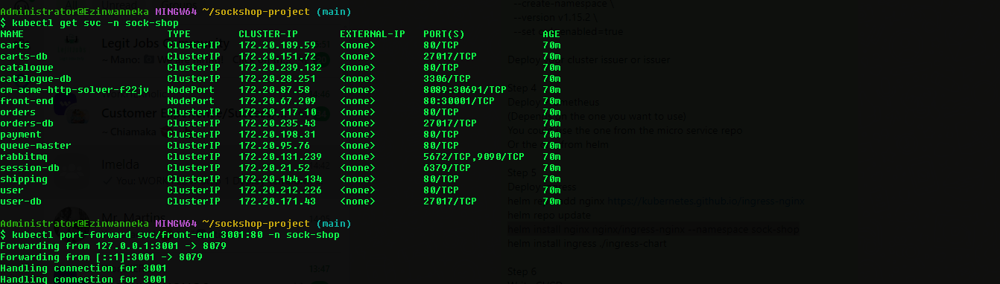

# shop-socks-project
# This project will use promotheus for cloudwatch

# Prerequisite:
1.  VScode and/or gitbash
2.  AWS aacount
3.  Install minikube and kutectl.
4.  Domain name
5.  Terraform installed on your local machine
6.  Choco and helm installed on your powershell

Using terraform, 

